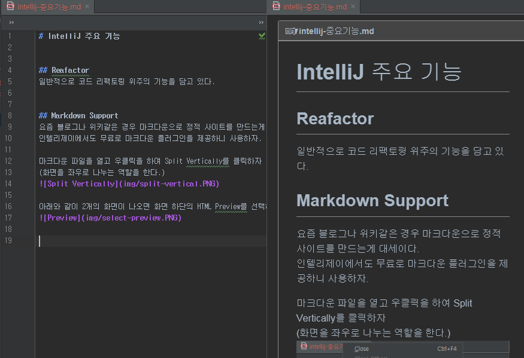

# IntelliJ 주요 기능

## Reafactor
일반적으로 코드 리팩토링 위주의 기능을 담고 있다.

## Markdown Support
요즘 블로그나 위키같은 경우 마크다운으로 정적 사이트를 만드는게 대세이다.
인텔리제이에서도 무료로 마크다운 플러그인을 제공하니 사용하자.

마크다운 파일을 열고 우클릭을 하여 Split Vertically를 클릭하자
(화면을 좌우로 나누는 역할을 한다.)

아래와 같이 2개의 화면이 나오면 화면 하단의 HTML Preview를 선택하자

결과화면
